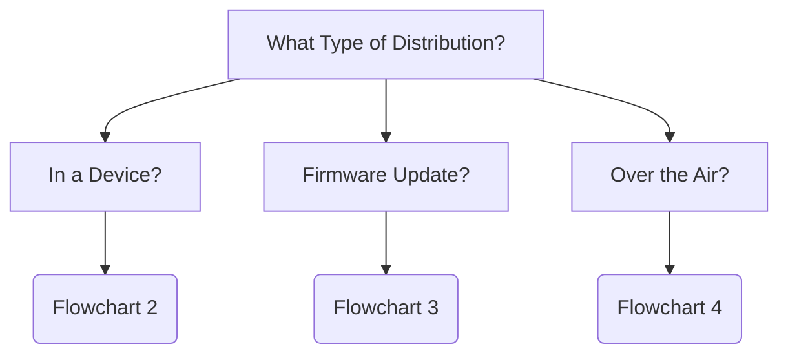

## Flowchart #1 - Distribution Type

```mermaid
flowchart TD
    A[What Type of Distribution?]
    A --> B[In a Device?] --> E(Flowchart 2)
    A --> C[Firmware Update?] --> F(Flowchart 3)
    A --> D[Over the Air?] --> G(Flowchart 4)
    click E "#product" "Flowchart 2"
    click F "#firmware" "Flowchart 3"
    click G "#linking" "Flowchart 4"
```