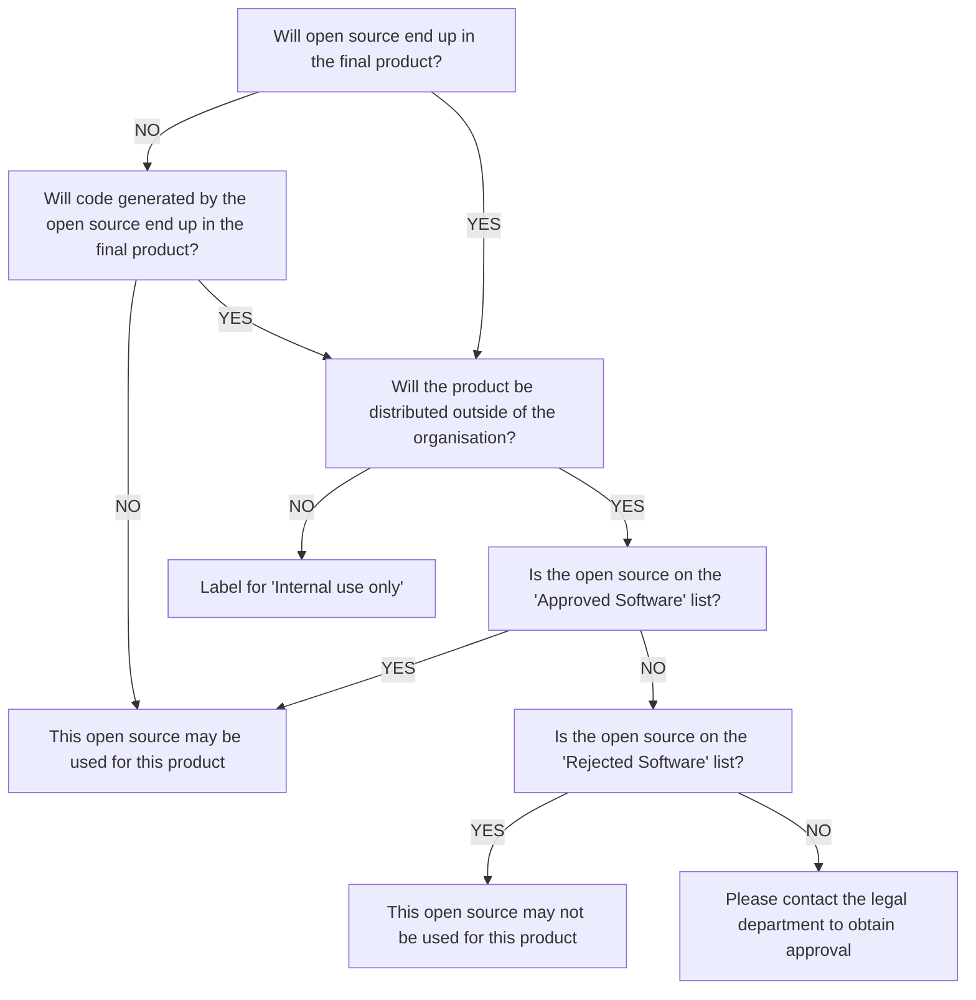

## Flowchart #0 - How Do I Distribute

```mermaid
flowchart TD
    A[Will open source end up in the final product?]
    A --> |NO| B[Will code generated by the open source end up in the final product?]
    A --> |YES| C[Will the product be distributed outside of the organisation?]
    B --> |YES| C
    C --> |YES| D[Is the open source on the 'Approved Software' list?]
    C --> |NO| E[Label for 'Internal use only']
    D --> |YES| F[This open source may be used for this product]
    B --> |NO| F
    D --> |NO| G[Is the open source on the 'Rejected Software' list?]
    G --> |YES| H[This open source may not be used for this product]
    G --> |NO| I[Please contact the legal department to obtain approval]
```
