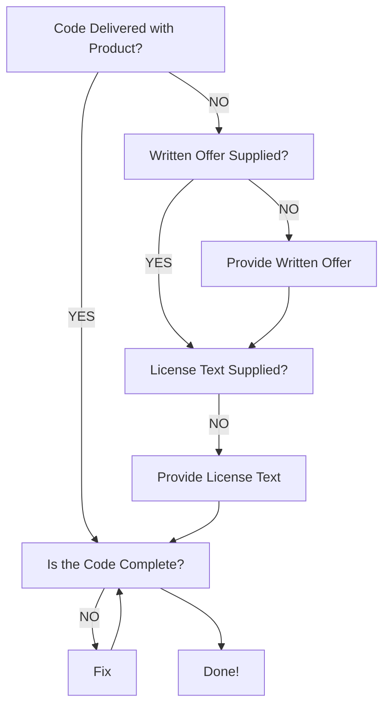

## Flowchart #2 - Offline Distribution

```mermaid
flowchart TD
    A[Code Delivered with Product?]
    A --> |YES| B[Is the Code Complete?] 
    A --> |NO| C[Written Offer Supplied?]
    B --> |NO| D[Fix] --> B
    C --> |YES| E[License Text Supplied?]
    C --> |NO| F[Provide Written Offer] --> E
    E --> |NO| G[Provide License Text] --> B
    B --> H[Done!]
```