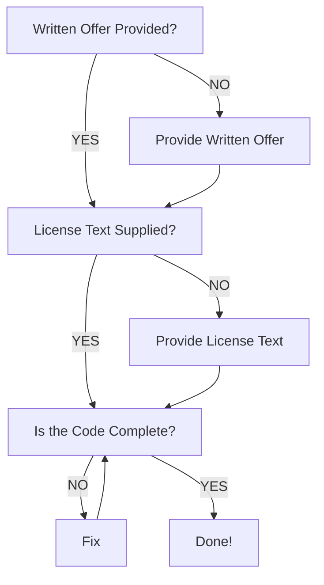

## Flowchart #4 - Over The Air

```mermaid
flowchart TD
    A[Written Offer Provided?]
    A --> |YES| B[License Text Supplied?]
    A --> |NO| C[Provide Written Offer] --> B
    B --> |YES| D[Is the Code Complete?]
    B --> |NO| E[Provide License Text] --> D
    D --> |NO| F[Fix] --> D
    D --> |YES| G[Done!]
```