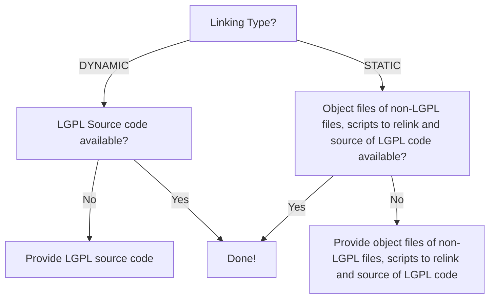

## Flowchart #5 - LGPL Code

```mermaid
flowchart TD
    A[Linking Type?]
    A --> |DYNAMIC| B[LGPL Source code available?] 
    A --> |STATIC| C[Object files of non-LGPL files, scripts to relink and source of LGPL code available?]
    B --> |No| D[Provide LGPL source code]
    C --> |No| E[Provide object files of non-LGPL files, scripts to relink and source of LGPL code]
    B --> |Yes| F[Done!]
    C --> |Yes| F
```