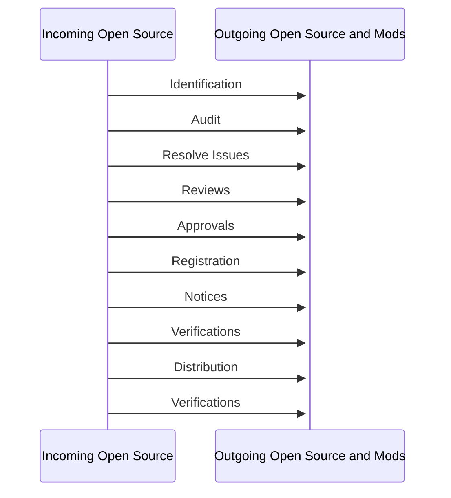

##### Slide Cover

# Reference Training Slides

Open Source Training for OpenChain ISO/IEC 5230:2020

##### Slide 1

MarkDown Edition - Version 1

Released under CC0-1.0. You may use, modify, and share these slides without restriction. They also come with no warranty.

These slides follow US law. Different legal jurisdictions may have different legal requirements. These slides are not legal advice.

Welcome to the OpenChain Curriculum Slides. These slides can be used to help train internal teams about Open Source compliance issues and to conform with the OpenChain Specification.

You can deliver these slides as one half-day training session or you can deliver each chapter as a separate module. Please note that each chapter has “Check Your Understanding” slides with questions and answers in the slide notes. These can be used as the basis for in-house tests for Open Source compliance.

##### Slide 2

## What are the OpenChain Reference Slides?

- The OpenChain Project defines the key requirements of a quality open source compliance program described in the International Standard for open source compliance: OpenChain ISO/IEC 5230

- These reference training slides help companies meet the requirements of the International Standard.

- These slides help companies satisfy the requirements of the Specification Section 3.1.2 (Competence). They can also be used for general compliance training.

Learn more at: <https://www.openchainproject.org>

##### Slide 3

## Contents

1. What is Intellectual Property?

2. Introduction to Open Source Licenses

3. Introduction to Open Source Compliance

4. Key Software Concepts for Open Source Review

5. Running an Open Source Review

6. End to End Compliance Management (Example Process)

7. Avoiding Compliance Pitfalls

8. Developer Guidelines

This slide is relevant to providing either a single three hour training session or explaining how a series of shorter sessions focused on “per chapter” training will work.

##### Slide 4

## CHAPTER 1: What is Intellectual Property?

This chapter is focused on the “big picture” of Intellectual Property. This chapter is probably most useful for managers or developers who might not fully understand the fundamentals of copyright, patent and trademark law.

##### Slide 5

## What is “Intellectual Property”?

- Copyright: protects original works of authorship

- Protects expression (not the underlying idea)

- It covers software, books, and similar works

- Patents: useful inventions that are novel and non-obvious

- Limited monopoly to incentivize innovation

- Trade secrets: protects valuable confidential information

- Trademarks: protects marks (word, logos, slogans, color, etc.) that identify the source of the product

- Consumer and brand protection; avoid consumer confusion and brand dilution

This chapter will focus on copyright and patents, the areas most relevant to Open Source compliance.

This overview is not intended to cover all aspects of Intellectual Property. It is intended to provide context for the “big picture” and to establish that today we are only discussing copyright and patents, the areas most relevant to Open Source compliance.

##### Slide 6

## Copyright Concepts in Software

- Basic rule: copyright protects creative works

- Copyright generally applies to literary works, such as books, movies, pictures, music, maps

- Software is protected by copyright

- Not the functionality (that’s protected by patents) but the expression (creativity in implementation details)

- Includes Binary Code and Source Code

- The copyright owner only has control over the work that he or she created, not someone else’s independent creation

- Infringement may occur if copying without the permission of the author

##### Slide 7

## Copyright Rights Most Relevant to Software

- The right to reproduce the software – making copies

- The right to create derivative works – making modifications

- The term “derivative work” comes from the US Copyright Act

- It is a “term of art” meaning that it has a particular meaning based on the statute and not the dictionary definition

- In general it refers to a new work based upon an original work to which enough original creative work has been added so that the new work represents an original work of authorship rather than a copy

- The right to distribute

- Distribution is generally viewed as the provision of a copy of a piece of software, in binary or source code form, to another entity (an individual or organization outside your company or organization)

Note: The interpretation of what constitutes a “derivative work” or a “distribution” is subject to debate in the Open Source community and within Open Source legal circles

##### Slide 8

## Patent Concepts in Software

- Patents protect functionality – this can include a method of operation, such as a computer program

- Does not protect abstract ideas, laws of nature

- A patent application must be made in a specific jurisdiction in order to obtain a patent in that country. If a patent is awarded, the owner has the right to stop anybody from exercising its functionality, regardless of independent creation

- Other parties who want to use the technology may seek a patent license (which may grant rights to use, make, have made, sell, offer for sale, and import the technology)

- Infringement may occur even if other parties independently create the same invention

##### Slide 9

## Licenses

- A “license” is the way a copyright or patent holder gives permission or rights to someone else

- The license can be limited to:

- Types of use allowed (commercial / non-commercial, distribution, derivative works / to make, have made, manufacture)

- Exclusive or non-exclusive terms

- Geographical scope

- Perpetual or time limited duration

- The license can have conditions on the grants, meaning you only get the license if you comply with certain obligations

- For example, your right to distribute the code is conditions on you providing attribution or corresponding source code

- May also include contractual terms regarding warranties, indemnification, support, upgrade, maintenance

##### Slide 10

## Check Your Understanding

- What type of material does copyright law protect?

- What copyright rights are most important for software?

- Can software be subject to a patent?

- What rights does a patent give to the patent owner?

- If you independently develop your own software, is it possible that you might need a copyright license from a third party for that software? A patent license?

Copyright protects original works of authorship. It's different than patent in that copyright protects the expression of an idea, whereas patent protects the underlying idea itself. Examples of works of authorship include photographs, songs, and computer code.

Most important copyright concepts for software are: right to reproduce, right to make creative works (or right to modify), and right to distribute.

Software can be subject to a patent. Patent protects method of operation, such as computer program. However, patent protects functionality, and not abstract ideas.

Patent holders can exclude others from practicing the patent, regardless of whether the others have independently created the product.

A copyright license is only needed if you took code from another author. Sometimes developers use a “clean room” approach to show the independent development and lack of access to the copyrighted work in question. If your software reads on a patent, then you will need a patent license regardless of whether you've independently developed the software or used open source that does not have rights to use the patented technology. An example of this is FFmpeg, which is a free software project that provides the codecs for encoding and decoding videos. However, you would still need a patent license to encode and decode a certain format.

##### Slide 11

## CHAPTER 2: Introduction to Open Source Licenses

This chapter is useful for lawyers, managers or developers who may not be familiar with Open Source licenses.

##### Slide 12

## Open Source Licenses

- Open Source licenses by definition make source code available under terms that allow for use, studying, modification and redistribution

- Open Source licenses may have conditions related to providing attributions, copyright statement preservation, or a written offer to make the source code available

- One popular set of licenses are those approved by the Open Source Initiative (OSI) based on their Open Source Definition (OSD). A complete list of OSI-approved licenses is available at <http://www.opensource.org/licenses/>

##### Slide 13

## Permissive Open Source Licenses

- Permissive Open Source license: a term used often to describe minimally restrictive Open Source licenses

- Example: BSD-3-Clause

- The BSD license is an example of a permissive license that allows unlimited redistribution for any purpose in source or object code form as long as its copyright notices and the license text are retained/reproduced

- The license contains a clause restricting use of the names of contributors for endorsement of a derived work without specific permission as well as a disclaimer of warranties

- Other examples: MIT, Apache-2.0

This slide explains ”permissive” Open Source licenses, a popular type of Open Source license, which usually have minimal requirements. The most basic requirement is to include a copyright notice. Permissive licenses do not require source code to be made available to downstream recipients.

##### Slide 14

## License Reciprocity & Copyleft Licenses

- Some licenses require that if derivative works (or software in the same file, same program or other boundary) are distributed, the distribution is under the same terms as the original work

- This is referred to as a “copyleft” or “reciprocal” effect

- Example of license reciprocity from the GPL version 2.0:

You must cause any work that you distribute or publish, that in whole or in part contains or is derived from the Program or any part thereof, to be licensed […] under the terms of this License.

- Some examples of licenses that include reciprocity or Copyleft clauses include all versions of the GPL, LGPL, AGPL, MPL and CDDL

- Sometimes these are referred to negatively as “viral” licenses

This slide explains reciprocity and Copyleft, a more complex type of Open Source license that has additional requirements beyond permissive licenses. They require distribution of the original work and derivative works under the same terms as the original work.

##### Slide 15

## Proprietary License or Closed Source

- A proprietary software license (sometimes erroneously called a commercial license) or EULA has restrictions on the usage, modification and/or distribution of the software

- Proprietary licenses are unique to each vendor – there are as many variations of proprietary licenses as there are vendors and each must be evaluated individually

- Open Source developers often use the term “proprietary” to describe a commercial non-Open Source license, even though both Open Source and proprietary licenses are based on intellectual property and provide a license grant to that property

##### Slide 16

## Other Non-Open Source Licensing Situations

- Freeware – software distributed under a proprietary license at no or very low cost

- The source code may or may not be available, and creation of derivative works is usually restricted

- Freeware software is usually fully functional (no locked features) and available for unlimited use (no locking on days of usage)

- Freeware software licenses usually impose restrictions in relation to copying, distributing, and making derivative works of the software, as well as restrictions on the type of usage (personal, commercial, academic, etc.)

- Shareware – proprietary software provided to users on a trial basis, for a limited time, free of charge and with limited functionalities or features

- The goal of shareware is to give potential buyers the opportunity to use the program and judge its usefulness before purchasing a license for the full version of the software

- Some companies avoid Shareware, because Shareware vendors often approach companies for large license payments after the software has freely propagated within their organizations.

##### Slide 17

## Other Non-Open Source Licensing Situations

- “Non-commercial” – some licenses have most of the characteristics of a Open Source license, but are limited to non-commercial use (e.g. CC-BY-NC).

- Open Source by definition cannot limit the field of use of the software

- Commercial use is a field of use so any restriction prevents the license from being Open Source

##### Slide 18

## Public Domain

- The term public domain refers to software not protected by law and therefore usable by the public without requiring a license

- Developers may include a public domain declaration with their software

- E.g., “All of the code and documentation in this software has been dedicated to the public domain by the authors.”

- The public domain declaration is not the same as a Open Source license

- A public domain declaration attempts to waive or eliminate any intellectual property rights that the developers may have in the software to make it clear that it can be used without restriction, but the enforceability of these declarations is subject to dispute within the Open Source community and its effectiveness at law varies from jurisdiction to jurisdiction

- Often the public domain declaration is accompanied by other terms, such as warranty disclaimers; in such cases, the software may be viewed as being under a license rather than being in the public domain

This slide explains public domain, a type of release that means the work is released without any restrictions whatsoever by the authors. In the US public domain software can be included in Open Source code, but it should be noted that not all legal jurisdictions recognize the existence or permit the release of authorship under public domain. Germany is one example.

##### Slide 19

## License Compatibility

- License compatibility is the process of ensuring that license terms do not conflict.

- If one license requires you to do something and another prohibits doing that, the licenses conflict - you may not be able to use them together.

- GPL-2.0 and EPL-1.0 each extend their obligations to “derivative works” which are distributed.

- If a GPL-2.0 module is combined with an EPL-1.0 module and the merged module is distributed, that module must

- (according to GPL-2.0) be distributed under GPL-2.0 only, and

- (according to EPL-1.0) under EPL-1.0 only.

- The distributor cannot satisfy both conditions at once so the module may not be distributed.

- This is an example of license incompatibility.

The definition of “derivative work” is subject to different views in the Open Source community and its interpretation in law is likely to vary from jurisdiction to jurisdiction.

This slide explains license compatibility, the way of understanding what licenses can be used together. Some Open Source licenses are compatible with each other. Some are incompatible. This is an important consideration when choosing code and choosing licenses.

##### Slide 20

## Notices

Notices, such as text in comments in file headers, often provide authorship and licensing information. Open Source licenses may also require the placement of notices in or alongside source code or documentation to give credit to the author (an attribution) or to make it clear the software includes modifications.

- Copyright notice – an identifier placed on copies of the work to inform the world of copyright ownership. Example: Copyright © A. Person (2016)

- License notice – a notice that specifies and acknowledges the license terms and conditions of the Open Source included in the product.

- Attribution notice – a notice included in the product release that acknowledges the identity of the original authors and / or sponsors of the Open Source included in the product.

- Modification notice – a notice that you have made modifications to the source code of a file, such as adding your copyright notice to the top of the file.

##### Slide 21

## Multi-Licensing

- Multi-licensing refers to the practice of distributing software under two or more different sets of terms and conditions simultaneously

- E.g., when software is “dual licensed,” the copyright owner gives each recipient the choice of two licenses

- Note: This should not be confused for situations in which a licensor imposes more than one license, and you must comply with all of them

This slides explains multi-licensing. This is the situation where more than one set of license terms can apply to a piece of software.

Multiple licenses apply (may be called Conjunctive or “AND” situation)

GPL-2.0 project also includes code under BSD-3-Clause

In this situation you have to comply with both sets of license terms

Choice of one open source license or another (may be called Disjunctive or “OR” situation)

Mozilla tri-license

Jetty

Ruby

Disjunctive licensing may be something important to explore more deeply when creating an Open Source policy.

Under disjunctive licensing you have a choice of licensing, e.g. GPL and a more permissive license option. You may choose which license you are going to distribute under depending on license compatibility, license requirements.

Sometimes a project has a disjunctive licensing situation, but only one license is included in your code – so perhaps the person you got the code from already made this choice. If they choose the license you weren’t going to use, now you might have to consider if you should figure out who the original © holder is and get the code directly from them

Example:

MPL 1.1/GPL 2.0/LGPL 2.1 - -

“The contents of this file are subject to the Mozilla Public License Version - 1.1 (the "License"); you may not use this file except in compliance with - the License.

Alternatively, the contents of this file may be used under the terms of - either the GNU General Public License Version 2 or later (the "GPL"), or - the GNU Lesser General Public License Version 2.1 or later (the "LGPL"), - in which case the provisions of the GPL or the LGPL are applicable instead - of those above.

If you wish to allow use of your version of this file only - under the terms of either the GPL or the LGPL, and not to allow others to - use your version of this file under the terms of the MPL, indicate your - decision by deleting the provisions above and replace them with the notice - and other provisions required by the LGPL or the GPL. If you do not delete - the provisions above, a recipient may use your version of this file under - the terms of any one of the MPL, the GPL or the LGPL. “

“dual” = term that may be used for any of these situations, but usually refers to business model of an OSS license or a commercial license choice

For more on dual-licensing as a business model: <http://oss-watch.ac.uk/resources/duallicence2>

##### Slide 22

## Check Your Understanding

- What is an Open Source license?

Open Source licenses are Free and Open Source Software licenses that generally make source code available under terms that allow for use, study, modification and redistribution.

- What are typical obligations of a permissive Open Source license?

Typical obligations of a permissive Open Source license are that the copyright notice and license text are included with the software.

- Name some permissive Open Source licenses.

Examples of permissive Open Source licenses include MIT, BSD, and Apache.

- What does license reciprocity mean?

License reciprocity means that the derivative work of the copyrighted work must be made available under the same license. Other names being used include "hereditary", "copyleft", "share-alike", and pejoratively "viral."

- Name some copyleft-style licenses.

Examples of copyleft-style licenses include GPL and LGPL.

- What needs to be distributed for code used under a copyleft license?

Copyleft-style licenses often have source code availability obligations, which require you to provide source code when you distribute a binary version of a program or library. The source code should be of the same version and content that corresponds to the binary you distribute.

- Are Freeware and Shareware software considered Open Source?

Freeware and Shareware are not Open Source. Even though freeware and shareware are available without cost, they don't allow the users to make modifications to the software. In fact, many of the freeware and shareware contain license restrictions common in proprietary software licenses.

- What is a multi-license?

Multi-license refers to the practice where software is made available under multiple licenses. For example, an open source software can be dual-licensed under MIT and GPL-2.0. In that case, you are free to choose the license that suits your need.

- What information may you find in Open Source Notices, and how may the notices be used?

Open Source Notices may include information about the identity of the copyright holders and the license governing the software. Open Source Notices may provide notice about modifications. Some licenses require that Open Source Notices be retained or reproduced for attribution purposes.

##### Slide 23

## CHAPTER 3: Introduction to Open Source Compliance

This chapter covers the big picture of Open Source compliance. It explains how compliance works from first principles.

##### Slide 24

## Open Source Compliance Goals

- Know your obligations. You should have a process for identifying and tracking Open Source components that are present in your software

- Satisfy license obligations. Your process should be capable of complying with Open Source license obligations that arise from your organization’s use of Open Source components

##### Slide 25

## What Compliance Obligations Must Be Satisfied?

Depending on the Open Source license(s) involved, your compliance obligations may consist of:

- Attribution and Notices. You may need to provide or retain copyright and license text in the source code and/or product documentation or user interface, so that downstream users know the origin of the software and their rights under the licenses. You may also need to provide notices regarding modifications, or full copies of the license.

- Source code availability. You may need to provide source code for the Open Source software, for modifications you make, for combined or linked software, and scripts that control the build process.

- Reciprocity. You may need to maintain modified versions or derivative works under the same license that governs the Open Source component.

- Other terms. The Open Source license may restrict use of the copyright holder name or trademark, may require modified versions to use a different name to avoid confusion, or may terminate upon any breach.

The scope of source code availability is determined by the Open Source license. Some licenses may require source code availability for only the Open Source software. Others may require all the software described in the slide.

##### Slide 26

## Open Source Compliance Issues: Distribution

- Dissemination of material to an outside entity

- Applications downloaded to an external user’s machine or mobile device

- JavaScript, web client, or other code that is downloaded to the external user’s machine

- For some Open Source licenses, access via a computer network can be a “trigger” event

- Some licenses define the trigger event to include permitting access to the software running on a server (e.g., Affero GPL v3 if the software is modified) or in the case of “users interacting with it remotely through a computer network”

##### Slide 27

## Open Source Compliance Issues: Modification

- Changes to the existing program (e.g., additions, deletions of code in a file, combining components together)

- Under some Open Source licenses, modifications may cause additional obligations upon distribution, such as:

- Providing notice of modification

- Providing modified source code

- Licensing modifications under the same license that governs the Open Source component

##### Slide 28

## Open Source Compliance Program

Organizations that have been successful at Open Source compliance have created their own Compliance Programs (consisting of policies, processes, training and tools) to:

1. Facilitate effective usage of Open Source in their products (commercial or otherwise)

2. Respect Open Source developer/owner rights and comply with license obligations

3. Contribute to and participate in Open Source communities

##### Slide 29

## Implementing Compliance Practices

Best practices to prepare business processes and sufficient staff to handle:

- Identification of the origin and license of all internal and external software

- Tracking Open Source software within the development process

- Performing Open Source review and identifying license obligations

- Fulfillment of license obligations

- Oversight for Open Source Compliance Program, creation of policy, and compliance decisions

- Training

##### Slide 30

## Compliance Benefits

Benefits of a robust Open Source Compliance program include:

- Increased understanding of the benefits of Open Source and how it impacts your organization

- Increased understanding of the costs and risks associated with using Open Source

- Increased knowledge of available Open Source solutions

- Reduction and management of infringement risk, increased respect of Open Source developers/owners’ licensing choices

- Fostering relationships with the Open Source community and Open Source organizations

##### Slide 31

## Check Your Understanding

- What does Open Source compliance mean?

- What are two main goals of an Open Source Compliance Program?

- List and describe important business practices of an Open Source Compliance Program.

- What are some benefits of an Open Source Compliance Program?

Open Source compliance means following the licensing terms of Open Source licenses. It involves understanding the licenses, having processes to support compliance with the license terms, and having processes to address any oversights or errors.

The two main goals of an Open Source compliance program are known your obligations and to satisfy your obligations. The important business practices of a Open Source compliance program include:

- Identification of the origin and license of Open Source software

- Tracking Open Source software within the development process

- Performing Open Source review and identifying license obligations

- Fulfillment of license obligations

- Oversight for Open Source Compliance Program, creation of policy, and compliance decisions

- Training

A Open Source compliance program provides various benefits such as an increased understanding of how Open Source impacts your organization, an increased understanding of the costs and risks associated with Open Source, better relations with the Open Source community and increased knowledge of available Open Source solutions.

##### Slide 32

## CHAPTER 4: Key Software Concepts for Open Source Review

This chapter describes some fundamental concepts in understanding Open Source usage

##### Slide 33

## How do you want to use an Open Source component?

Common scenarios include:

- Incorporation

- Linking

- Modification

- Translation

##### Slide 34

## Incorporation

A developer may copy portions of an Open Source component into your software product.

Relevant terms include:

- Integrating

- Merging

- Pasting

- Adapting

- Inserting

##### Slide 35

## Linking

A developer may link or join an Open Source component with your software product.

Relevant terms include:

- Static/Dynamic Linking

- Pairing

- Combining

- Utilizing

- Packaging

- Creating interdependency

##### Slide 36

## Modification

A developer may make changes to a Open Source component, including:

- Adding/injecting new code into the Open Source component

- Fixing, optimizing or making changes to the Open Source component

- Deleting or removing code

##### Slide 37

## Translation

A developer may transform the code from one state to another.

Examples include:

- Translating Chinese to English

- Converting C++ to Java

- Compiling into binary

##### Slide 38

## Development Tools

Development tools may perform some of these operations behind the scenes.

For example, a tool may inject portions of its own code into output of the tool.

##### Slide 39

## How is the Open Source component distributed?

- Who receives the software?

- Customer/Partner

- Community project

- Another legal entity within the business group (this may count as distribution)

- What format for delivery?

- Source code delivery

- Binary delivery

- Pre-loaded onto hardware

##### Slide 40

## Check Your Understanding

- What is incorporation?

- What is linking?

- What is modification?

- What is translation?

- What factors are important in assessing a distribution?

Incorporation is when you copy an Open Source component or portions of a component into your software product. Linking is when you link or join an Open Source component with your software product. Modification is when you make changes to an Open Source component. Translation is when you transform the code from one state to another.

When thinking about distribution of Open Source you should consider two things:

Who receives the software?

- Customer/Partner

- Community project

What is the format for delivery?

- Source code delivery

- Binary delivery

- Pre-loaded onto hardware

##### Slide 41

## CHAPTER 5: Running a Open Source Review

This chapter describes a “Open Source Review” process in which Open Source usage is analyzed and the relevant obligations are determined

##### Slide 42

## Open Source Review

- After Program and Product Management and Engineers have reviewed proposed Open Source components for usefulness and quality, a review of the rights and obligations  
associated with the use of the selected components should be initiated

- A key element to an Open Source Compliance Program is an Open Source Review process. This process is where a company can analyze the Open Source software it uses and understand its rights and obligations

- The Open Source Review process includes the following steps:

- Gather relevant information

- Analyze and understand license obligations

- Provide guidance compatible with company policy and business objectives

The Open Source Review is a basic building block of an Open Source Compliance Program.

An Open Source Review can be the meeting point for engineering, business and legal teams, and can require planning and organization to successfully conduct on a large scale.

- Engineering or developer teams may participate in gathering relevant information

- Legal teams analyze and determine license obligations and provide guidance

- Business and engineering teams may receive and implement guidance

##### Slide 43

## Initiating a Open Source Review

Anyone working with Open Source in the company should be able to initiate an Open Source Review, including Program or Product Managers, Engineers, and Legal.

Note: The process often starts when new Open Source-based software is selected by engineering or outside vendors.

The first step is to identify the proper parties to initiate a Open Source Review

Important questions to ask include:

- Who are the decision makers about Open Source usage (managers, architects, individual engineers, etc.)?

- How can they raise questions about Open Source usage?

- Is there a regular point in your development process where Open Source Reviews can begin?

##### Slide 44

## What information do you need to gather?

When analyzing Open Source usage, collect information about the identity of the Open Source component, its origin, and how the Open Source component will be used. This may include:

- Package name

- Status of the community around the package (activity, diverse membership, responsiveness)

- Version

- Download or source code URL

- Copyright owner

- License and License URL

- Attribution and other notices and URLs

- Description of modifications intended to be made

- List of dependencies

-Functionality and iIntended use in your product

- First product release that will include the open source

- Location where the source code will be maintained

- Possible previous approvals in another context

- If from an external vendor:

- Development team's point of contact

- Copyright notices, attribution, source code for vendor modifications if needed to satisfy license obligations

It should be noted that this list of information looks quite large. However, the amount of information required depends on the size of your company and what you intend to do with the Open Source code. Large entities tend to require more information than small entities.

There are a couple of additional issues in the case of external vendors. First, you may need to follow up with the vendor if Open Source issues or questions arise, and having a reliable point of contact is important. You may also need to meet Open Source license obligations for Open Source delivered from the vendor. Ensure you have the notices and source code as needed to meet these obligations.

##### Slide 45

## Open Source Review Team

A Open Source Review team includes the company representatives that support, guide, coordinate and review the use of Open Source. These representatives may include:

- Legal to identify and evaluate license obligations

- Source code scanning and tooling support to help identify and track Open Source usage

- Engineering Specialists working with security, business interests, commercial licensing, export compliance, etc., who may be impacted by Open Source usage

The Open Source Review team may consist of an interdisciplinary team

The legal team, which may include in-house or outside attorneys, reviews and evaluates the Open Source usage for license obligations

The legal team may be supported by others, including:

- Scanning and tooling teams that identify and track Open Source usage. These teams may provide support using code scanning or forensics tools to identify Open Source components in a codebase. The teams may also organize and track information gathered regarding Open Source usage to assist with later compliance processes.

- Other specialists or representatives that may be impacted by Open Source-related issues, such as commercial licensing, compliance or business planning teams.

##### Slide 46

## Analyzing Proposed Open Source Usage

The Open Source Review team should assess the information it has gathered before providing guidance for issues. This may include scanning the code to confirm the accuracy of the information.

The Open Source Review team should consider:

- Is the code and associated information complete, consistent and accurate?

- Does the declared license match what is in the code files?

- Does the license permit use with other components of the software?

The Open Source Review team should have the expertise to properly assess the Open Source usage. This may require support from engineering teams to educate legal and business teams about the proposed Open Source usage. For example, code scanning may be used to locate undisclosed Open Source usage.

Once the proposed Open Source usage has been fully assessed, the legal team will then have the necessary information on which to make its judgments and provide compliance guidance.

##### Slide 47

## Source Code Scanning Tools

- There are many different automated source code scanning tools.

- All of the solutions address specific needs and - for that reason - none will solve all possible challenges

- Companies pick the solution most suited to their specific market area and product

- Many companies use both an automated tool and manual review

- An example of freely available source code scanning tool is FOSSology, a project hosted by the Linux Foundation: <https://www.FOSSology.org>

##### Slide 48

## Working through the Open Source Review

The Open Source Review process crosses disciplines, including engineering, business, and legal teams. It should be interactive to ensure all those groups correctly understand the issues and can create clear, shared guidance.

The Open Source Review process should be flexible enough to allow the interested parties to collaborate. Sometimes a Open Source usage scenario may not be clear to the Open Source review team. The engineering team will need the ability to provide further input. Likewise, the engineering team may need assistance in implementing guidance from the Open Source review team.

##### Slide 49

## Open Source Review Oversight

The Open Source Review process should have executive oversight to resolve disagreements and approve the most important decisions.

The Open Source Review process should have oversight (for example, an Executive Review Committee in this diagram). The oversight committee may make important policy decisions or resolve disagreements between parties in the review process.

##### Slide 50

## Check Your Understanding

- What is the purpose of an Open Source Review?

- What is the first action you should take if you want to use Open Source components?

- What should you do if you have a question about using Open Source?

- What kinds of information might you collect for an Open Source review?

- What information helps identify who is licensing the software?

- What additional information is important when reviewing an Open Source component from an outside vendor?

- What steps can be taken to assess the quality of information collected in an Open Source Review?

To gather and analyze information regarding Open Source usage and to produce appropriate guidance.

Initiate an Open Source review process. The method for initiating this process may vary by company, but should be open to those who are involved in using Open Source in development.

Initiate an Open Source review process or contact the Open Source review team. The process should be flexible enough so that Open Source users in your organization have access to guidance.

The package name, version, download URL, license, description and intended use in your product is a good starting point. The precise level of detail you will need depends on your organization and intended use case.

The copyright notices, attribution and source code normally helps to identify who is licensing the Open Source software.

Development team's point of contact in case you need to follow up with future Open Source issues. You may also want to obtain copyright and attribution notices, and source code for vendor modifications if these are needed to satisfy license obligations for Open Source licenses governing the third party software.

Check information for completeness, consistency and accuracy. This process may be assisted by support teams, including teams that run code scanning tools to scan for undisclosed Open Source usage.

##### Slide 51

## CHAPTER 6: End to End Compliance Management (Example Processes)

This chapter contains an example of a detailed end to end compliance management process.

##### Slide 52

## Introduction

- Compliance management is a set of actions that manages Open Source components used in products. Companies may have similar processes in place for proprietary components.

- Such actions often include:

- Identifying all the Open Source components used in Supplied Software

- Identifying and tracking all obligations created by those components

- Confirming that all obligations have been or will be met

- Small companies may use a simple checklist and enterprises a detailed process.

Note that this section provides a detailed example of what may take place in a large enterprise. Smaller companies may wish to approach the process in a more streamlined way.

##### Slide 53

## Example Small to Medium Company Checklist

Ongoing Compliance Tasks:

1. Discover all Open Source early in the procurement/development cycle

2. Review and Approve all Open Source components used

3. Verify the information necessary to satisfy Open Source obligations

4. Review and approve any outbound contributions to Open Source projects

Support Requirements:

1. Ensure adequate compliance staffing and designate clear lines of responsibility

2. Adapt existing Business Processes to support the Open Source compliance program

3. Have training on the organization’s Open Source policy available to everyone

4. Track progress of all Open Source compliance activities

You can get detailed checklists for these items here: <https://github.com/OpenChain-Project/Reference-Material/tree/master/Self-Certification> and an online checklist here: <https://openchainproject.org/checklist-iso-5230-2020> 

##### Slide 54

## Example Enterprise Process

##### Slide 55

## Identify and Track Open Source Usage

### Identify Open Source components

Steps:

- Incoming requests from engineering

- Scans of the software

- Due diligence of 3rd-party software

- Manual recognition of new components added to the repository

Outcome:

- A compliance record is created (or updated) for the Open Source

- An audit is requested to review the source code with a scope a defined as exhaustive or limited according to Open Source policy requirements.

The first step in our example process is to identify Open Source usage.

This step may have been initiated by one of the events listed in “prerequisites.” For example, a development team may have initiated a request (or initiated a Open Source Review). The step may also begin if the review team discovers or is notified that Open Source is being used in a software release or in third party software used by the company, and that a proper review needs to take place.

In this example, the Open Source review team may identify Open Source usage through review requests from engineers, from performing scans of internally-developed and third-party software, or reviewing code checked into development branches. The review team will then create a record of the review, then move to the next step (“Audit”).

##### Slide 56

## Auditing Source Code

### Identify and audit Open Source licenses

Steps:

- Source code for the audit is identified

- Source may be scanned by a software tool

- “Hits” from the audit or scan are reviewed and verified as to the proper origin of the code

- Audits or scans are performed iteratively based on the software development and release lifecycles

Outcome:

- An audit report identifying:

1. The origins and licenses of the source code

2. Issues that need resolving

The next step is auditing source code identified in the previous step.

In our example, the company may conduct research into the identified Open Source component (e.g., review declared licenses, research origins of the Open Source component). The company may also scan the source code to verify the origin and composition of the code.

The review team may then produce an audit report with its conclusions regarding the origin and licensing of the source code.

##### Slide 57

## Resolving Issues

### Resolve all issues identified in the audit

Steps:

- Provide feedback to the appropriate engineers to resolve issues in the audit report that conflict with your Open Source policy

- The appropriate engineers then conduct Open Source Reviews on the relevant source code (see next slide for template)

Outcome:

- A resolution for each of the flagged files in the report and a resolution for any flagged license conflict

Once an audit report is produced that confirms the origin and licensing of source code, the review team should flag and review any issues under the company Open Source policy. For example, the earlier steps may have identified an Open Source component that contains other Open Source code under an incompatible license. The review team should provide appropriate feedback to the engineering team to resolve the issues.

##### Slide 58

## Architecture Review (Example Template)

This slide contains a template that may be used to illustrate Open Source usage and its relationship with company software. For example, how are Open Source and company components linked together? Templates such as these may be created by engineering teams to help educate the Open Source review team about planned Open Source usage.

##### Slide 59

## Performing Reviews

### Review the resolved issues to confirm it matches your Open Source policy

Steps:

- Include appropriate authority levels in review staff

- Conduct review with reference to your Open Source policy

Outcome:

- Ensure the software in the audit report conforms with Open Source policies

- Preserve audit report findings and mark resolved issues as ready for the next step (i.e. Approval)

In this step, the Open Source review team reviews the facts collected in the previous steps and identifies the company’s obligations under the Open Source licenses.

This step may be closely linked with the previous step (Resolving Audit Issues). In the previous step we removed Open Source usage that did not conform to company policy. In this step, we evaluate and identify the license obligations for Open Source usage that is retained.

##### Slide 60

## Approvals

- Based on the results of the software audit and review in previous steps, software may or may not be approved for use

- The approval should specify versions of approved Open Source components, the approved usage model for the component, and any other applicable obligations under the Open Source license

- Approvals should be made at appropriate authority levels

In the approval step of our example process, the review team communicates whether it approves of the Open Source usage in question, along with any associated conditions or obligations. The approval should also include important details such as version numbers of Open Source components and the approved usage scenario.

##### Slide 61

## Registration / Approval Tracking

- Once a Open Source component has been approved for usage in a product, it should be added to the software inventory for that product

- The approval and its conditions should be registered in a tracking system

- The tracking system should make it clear that a new approval is needed for a new version of a Open Source component or if a new usage model is proposed

##### Slide 62

## Notices

Prepare appropriate notices for any Open Source used in a product release:

- Acknowledge the use of Open Source by providing full copyright and attribution notices

- Inform the end user of the product on how to obtain a copy of the Open Source source code (when applicable, for example in the case of GPL and LGPL)

- Reproduce the entire text of the license agreements for the Open Source code included in the product as needed

If required by the Open Source license(s), appropriate notices should be prepared (often in a text file that accompanies the release). Notices may include attribution notices, modification notices, or offers for source code. For some licenses, you may also need to include a full copy of the license text.

##### Slide 63

## Pre-Distribution Verifications

### Verify that distributed software has been reviewed and approved

Steps:

- Verify Open Source packages destined for distribution have been identified and approved

- Verify the reviewed source code matches the binary equivalents shipping in the product

- Verify all appropriate notices have been included to inform end-users of their right to request source code for identified Open Source

- Verify compliance with other identified obligations

Outcome:

- The distribution package contains only software that has been reviewed and approved

- "Distributed Compliance Artifacts" (as defined in the OpenChain specification), including appropriate notice files are included in the distribution package or other delivery method

In this slide of our example process, the company verifies that it has met its Open Source license obligations before release. In cases where source code must be made available, the company verifies that the source code corresponds to the binary files being distributed. The company also verifies that notices are properly produced and included in distribution packages as needed.

##### Slide 64

## Accompanying Source Code Distribution

### Provide accompanying source code as required

Steps:

- Provide accompanying source code along with any associated build tools and documentation (e.g., by uploading to a distribution website or including in the distribution package)

- Accompanying source code is identified with labels as to which product and version it corresponds

Outcome:

- Obligations to provide accompanying source code are met

In cases where source code must be made available, the company provides the accompanying source code through the mechanisms permitted under the Open Source license. This may mean providing the source code along with the software distribution, making it available through a written offer, or posting a source code archive on a website.

##### Slide 65

## Final Verifications

### Validate compliance with license obligations

Steps:

- Verify accompanying source code (if any) has been uploaded or distributed correctly

- Verify uploaded or distributed source code corresponds to the same version that was approved

- Verify notices have been properly published and made available

- Verify other identified obligations are met

Outcome:

- Verified Distributed Compliance Artifacts are appropriately provided

##### Slide 66

## Check Your Understanding

- What is involved in compliance due diligence (for our example process, describe the steps at a high level)?

- Identification

- Audit source code

- Resolving issues

- Performing reviews

- Approvals

- Registration/approval tracking

- Notices

- Pre-distribution verifications

- Accompanying source code distribution

- Verification

- What does an architecture review look for?

For our example process, the steps include:

- Identification - Identify and track Open Source usage. This may take place through engineer requests, third party disclosures, or code scanning.

- Auditing source code - Review identified Open Source components for license and origin information.

- Resolving issues - Remove Open Source usage that is incompatible with Open Source policies.

- Performing reviews - Assess and determine obligations for Open Source usage.

- Approvals - Communicate approval conditions and license obligations.

- Registration/approval tracking – Track approval conditions and license obligations for later compliance steps.

- Notices - Prepare notices as required by Open Source licenses.

- Pre-distribution verifications – Review distributions for compliance before release.

- Accompanying Source Code Distribution – Make source code available as needed.

- Verification – Provide oversight for compliance process.

For our example process, the steps include:

- Identification - Identify and track Open Source usage. This may take place through engineer requests, third party disclosures, or code scanning.

- Auditing source code - Review identified Open Source components for license and origin information.

- Resolving issues - Remove Open Source usage that is incompatible with Open Source policies.

- Performing reviews - Assess and determine obligations for Open Source usage.

- Approvals - Communicate approval conditions and license obligations.

- Registration/approval tracking – Track approval conditions and license obligations for later compliance steps.

- Notices - Prepare notices as required by Open Source licenses.

- Pre-distribution verifications – Review distributions for compliance before release.

- Accompanying Source Code Distribution – Make source code available as needed.

- Verification – Provide oversight for compliance process.

Architecture reviews examine the relationships between Open Source components and company software. For example, how are Open Source and company components linked together?

##### Slide 67

## CHAPTER 7: Avoiding Compliance Pitfalls

This chapter describes some common pitfalls in Open Source compliance processes, and discusses approaches to avoiding these pitfalls

##### Slide 68

## Compliance Pitfalls

This chapter will describe some potential pitfalls to avoid in the compliance process:

1. Intellectual Property (IP) pitfalls

2. License Compliance pitfalls

3. Compliance Process pitfalls

##### Slide 69

## Intellectual Property Pitfalls

### Type & Description

Unplanned inclusion of copyleft Open Source into proprietary or 3rd party code:

This type of failure occurs during the development process when engineers add Open Source code into source code that is intended to be proprietary in conflict with the Open Source policy.

### Discovery

This type of failure can be discovered by scanning or auditing the source code for possible matches with:

- Open Source source code

- Copyright notices

Automated source code scanning tools may be used for this purpose

### Avoidance

This type of failure can be avoided by:

- Offering training to engineering staff about compliance issues, the different types of Open Source licenses and the implications of including Open Source in proprietary source code

- Conducting regular source code scans or audits for all the source code in the build environment.

The first pitfall described in this slide arises where copyleft-style licensed Open Source is inadvertently mixed with proprietary code.

This may be discovered through auditing source code for license notices or using code scanning tools.

Preventative measures include training of engineering staff, and building regular audits or scans into the development process.

##### Slide 70

## Intellectual Property Pitfalls

### Type & Description

Unplanned linking of copyleft Open Source and proprietary source code:

This type of failure occurs as a result of linking software with conflicting or incompatible licenses. The legal effect of linking is subject to debate in the Open Source community.

### Discovery

This type of failure can be discovered using a dependency tracking tool that shows any linking between different software components.

### Avoidance

This type of failure can be avoided by:

1. Offering training to engineering staff to avoid linking software components with licenses that conflict with you Open Source policies which will take a position on these legal risks

2. Continuously running the dependency tracking tool over your build environment

### Type & Description

Inclusion of proprietary code into copyleft Open Source through source code modifications

### Discovery

This type of failure can be discovered using the audits or scans to identify and analyze the proprietary source code introduced to the Open Source component.

### Avoidance

This type of failures can be avoided by:

1. Offering training to engineering staff

2. Conducting regular code audits

The first pitfall in this slide arises where copyleft-style licensed Open Source is inadvertently linked to proprietary code.

This type of failure may be detected using dependency tracking tools or reviews of architecture.

Preventative measures include training of engineering staff, and building architectural reviews into the development process.

The second pitfall arises where proprietary code is included in copyleft-style licensed Open Source. For example, an engineering team making modifications to an Open Source component may include proprietary code in the modifications.

This type of failure may be discovered through auditing source code introduced into the Open Source component.

Preventative measures include training of engineering staff and building regular audits into the development process.

##### Slide 71

## License Compliance Pitfalls

### Type & Description

Failure to Provide Accompanying Source Code/appropriate license, attribution or notice information

### Avoidance

This type of failure can be avoided by making source code capture and publishing a checklist item in the product release cycle before the product becomes available in the marketplace.

### Type & Description

Providing the Incorrect Version of Accompanying Source Code

### Avoidance

This type of failure can be avoided by adding a verification step into the compliance process to ensure that the accompanying source code for the binary version is being published.

### Type & Description

Failure to Provide Accompanying Source Code for Open Source Component Modifications

### Avoidance

This type of failure can be avoided by adding a verification step into the compliance process to ensure that source code for modifications are published, rather than only the original source code for the Open Source component

The first pitfall in this slide arises where a company has an obligation to provide accompanying source code, but fails to do so.

The second pitfall arises where a company provides accompanying source code, but fails to provide the version that matches the distributed binary version.

The third pitfall arises when a company modifies an Open Source component, but fails to publish the modified version of the source code. The company instead publishes the source code for the original version of the Open Source component.

In each case, the failures may be prevented by properly applying steps in the compliance process. For example, source code for released binaries should be captured and stored along with the binary version. Verifications prior to release should check to ensure the proper source code is provided with the binary release.

##### Slide 72

## License Compliance Pitfalls

### Type & Description

Failure to mark Open Source Source Code Modifications:

Failure to mark Open Source source code that has been changed as required by the Open Source license (or failure to provide information about modifications which has a sufficient level of detail or clarity to satisfy the license)

### Avoidance

This type of failure can be avoided by:

1. Adding source code modification marking as a verification step before releasing the source code

2. Offering training to engineering staff to ensure they update copyright markings or license information of all Open Source or proprietary software that is going to be released to the public

The pitfall in this slide arises where a company modifies an Open Source component, then fails to mark its modifications when required by the Open Source license. This pitfall may be prevented through implementing processes for marking code or within verification steps.

##### Slide 73

## Compliance Process Failures

### Description

Failure by developers to seek approval to use Open Source

### Avoidance

This type of failure can be avoided by offering training to Engineering staff on the company’s Open Source policies and processes.

### Prevention

This type of failure can be prevented by:

1. Conducting periodic full scan for the software platform to detect any “undeclared” Open Source usage

2. Offering training to engineering staff on the company's Open Source policies and processes

3. Including compliance in the employee’s performance review

### Description

Failure to take the Open Source training.

### Avoidance

This type of failure can be avoided by ensuring that the completion of the Open Source training is part of the employee’s professional development plan and it is monitored for completion as part of the performance review.

### Prevention

This type of failure can be prevented by mandating engineering staff to take the Open Source training by a specific date.

The pitfalls in this slide arise from a failure to integrate the Open Source compliance process with the engineering team. In these cases, the engineering team does not raise Open Source usage to the review process, or does not receive the training on how to handle Open Source usage.

Preventative measures include monitoring of engineering training, and making the compliance process easily accessible to the engineering team.

##### Slide 74

## Compliance Process Failures

### Description

Failure to audit the source code.

### Avoidance

This type of failure can be avoided by:

1. Conducting periodic source code scans/audits

2. Ensuring that auditing is a milestone in the iterative development process

### Prevention

This type of failure can be prevented by:

1. Providing proper staffing as to not fall behind in schedule

2. Enforcing periodic audits

### Description

Failure to resolve the audit findings (analyzing the "hits" reported by a scan tool or audit)

### Avoidance

This type of failure can be avoided by not allowing a compliance ticket to be resolved (i.e. closed) if the audit report is not finalized.

### Prevention

This type of failure can be prevented by implementing blocks in approvals in the Open Source compliance process.

### Description

Failure to seek review of Open Source in a timely manner.

### Avoidance

This type of failure can be avoided by initiating Open Source Review requests early even if engineering did not yet decide on the adoption of the Open Source source code.

### Prevention

This type of failure can be prevented through education.

This slide describes potential consequences of compliance process failures. In the first case, a code base may be used in development and released without proper review. In the second case, Open Source usage may be known, but license obligations are not reviewed or fulfilled. In the last case, the compliance process may face release deadline pressures and have limited time to perform its tasks.

##### Slide 75

## Ensure Compliance Prior to Product Release

- Companies must make compliance a priority before any product (in whatever form) is released

- Prioritizing compliance promotes:

- More effective use of Open Source within your organization

- Better relations with the Open Source community and Open Source organizations

- Reduced legal risk to the project and the company

While avoiding the pitfalls described in this chapter may take resources and effort, prioritizing the Open Source compliance process is important. It can help you more effectively use Open Source in your development process, help maintain good working relationships within the Open Source community, and reduce overall legal risk for the product..

##### Slide 76

## Establishing Community Relationships

As a company that uses Open Source in a commercial product, it is best to create and maintain a good relationship with the Open Source community - in particular, with the specific communities related to the Open Source projects you use and deploy in your commercial products.

In addition, good relationships with Open Source organizations can be very helpful in advising on best way to be compliant and also help out if you experience a compliance issue.

Good relationships with the software communities may also be helpful for two-way communication: upstreaming improvements to the open source component(s) and getting support from the software developers that are part of that community..

##### Slide 77

## Check Your Understanding

- What types of pitfalls can occur in Open Source compliance?

- Give an example of an intellectual property failure.

- Give an example of a license compliance failure.

- Give an example of a compliance process failure.

- What are the benefits of prioritizing compliance?

- What are the benefits of maintaining a good community relationship?

Pitfalls can occur under the following categories: IP failure, license compliance failure, and compliance process failure.

An example of IP failure would be commingling of proprietary code and open source code, which may result in making proprietary software available to the general public despite the company's preference.

An example of license compliance failure would be a failure to mark an open source software after modification or to properly list the open source software components in the software or to make the complete and corresponding source code available.

An example of compliance process failure would be a failure in the process related to audit, review, or approving the open source software. Auditors "waived" all the red-flagged items in a report, or that the review and approval process takes too long.

The benefits of prioritizing compliance are that you become more efficient in your use of Open Source, and that you build a better relationship with the open source community.

The benefits of maintaining a good community relationship are that you can better assess how you can comply with the Open Source license requirements, and you have better two-way communication with regard to contribution and use of the Open Source.

##### Slide 78

## CHAPTER 8: Developer Guidelines

##### Slide 79

## Developer Guidelines

- Select code from high quality, well supported Open Source communities

- Seek guidance

- Request formal approval for each Open Source component you are using

- Do not check code into any internal source tree

- Request formal approval for outside contributions to Open Source projects

- Preserve existing licensing information

- Do not remove or in any way disturb existing Open Source licensing copyrights or other licensing information from any Open Source components that you use. All copyright and licensing information is to remain intact in all Open Source components.

- Do not rename Open Source components unless you are required to under the Open Source license (e.g., required renaming of modified versions)

- Gather and retain Open Source project information required for your Open Source review process

##### Slide 80

## Anticipate Compliance Process Requirements

- Include time required to follow established Open Source policy in work plans

- Follow the developer guidelines for using Open Source software, particularly incorporating or linking Open Source code into proprietary or third party source code or vice versa

- Review architecture plans and avoid mixing components governed by incompatible Open Source licenses

- Always update compliance verification - for every product

- Verify compliance on a product-by-product basis: Just because a Open Source package is approved for use in one product does not necessarily mean it will be approved for use in a second product

- And for every upgrade to newer versions of Open Source

- Ensure that each new version of the same Open Source component is reviewed and approved

- When you upgrade the version of a Open Source package, make sure that the license of the new version is the same as the license of the older used version (license changes can occur between version upgrades)

- If a Open Source project’s license changes, ensure that compliance records are updated and that the new license does not create a conflict

##### Slide 81

## Compliance Process Applies to all Open Source components

- Inbound software

- Take steps to understand what Open Source is included in software delivered by suppliers

- Evaluate your obligations for all of the software that will be included in your products

- Always audit source code you received from your software providers or alternatively make it a company policy that software providers must deliver you a source code audit report for any source code you receive

##### Slide 82

## Check Your Understanding

- Name some general guidelines developers can practice when working with Open Source.

- Should you remove or alter Open Source license header information?

- Name some important steps in a compliance process.

- How can a new version of a previously-reviewed Open Source component create new compliance issues?

- What risks should you address with in-bound software?

Learn more through the free Compliance Basics for Developers hosted by the Linux Foundation at: <https://training.linuxfoundation.org/training/introduction-to-open-source-license-compliance-management-lfc193/>

General guidelines developers can practices when working with Open Source:

- Select code from high quality Open Source communities

- Seek guidance

- Preserve existing licensing information

- Gather and retain Open Source project information for your review process

Should you remove or alter Open Source license header information? No – existing. license information should be preserved, additional header information can be added for modifications or additions to source code (note, some licenses require documenting changes).

Important steps in a compliance process:

- Follow developer guidelines, especially for any Open Source code included in or linked to proprietary code

- Review and approve all Open Source early in the cycle

- Review architecture and avoid mixing components governed by incompatible licenses

- Verify Open Source Licensecompliance for every product and every version prior to release

- Review Open Source License compliance for new versions of Open Source in use.

A new version of a previously reviewed Open Source component can create new compliance issues by:

- A change in the Open Source license for the new version of the Open Source component(e.g. ghostscript <https://en.wikipedia.org/wiki/Ghostscript>)

- New dependencies introduced with new versions which create additional Open Source obligations. These dependencies may be embedded in the Open Source distribution or they may be dependencies resolved at build time.

What risks should you address with inbound software?

- License compliance for any disclosed Open Source embedded in the inbound software

- The potential for creating license conflicts by integrating inbound software with other Open Source or proprietary software

- Undisclosed or unknown Open Source included in the inbound software
